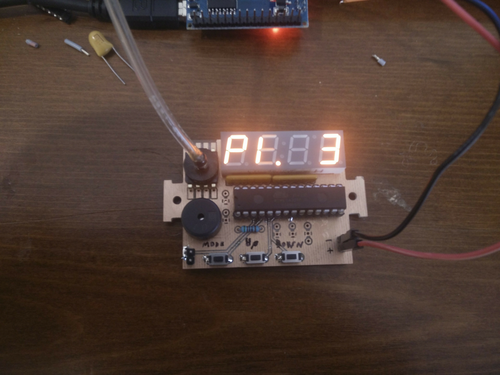

# Illinois Ventmon - A sensor and alarm module for pressure-cycled ventilators

The Illinois Ventmon is a sensor and alarm module for use with pressure-cycled ventilators. The module connects to a ventilator circuit and monitors the pressure delivered to the patient airway. It creates an audible alarm when it detects that the system is not operating normally and displays information about pressure and breathing rate. The VentMon is designed to be rapidly produced from readily available parts. The electronic kit can be assembled by hand on a breadboard, by hand-soldering parts to a printed circuit board, or by machine for large-scale production. This website contains hardware designs, software code, and documentation to allow anyone to build their own Illinois Ventmon or to adapt the design to their own needs.

## Overview

The Illinois Ventmon uses an electronic pressure sensor that connects to the ventilator via a tube. The tube is attached to the patient side of the ventilator circuit using an off-the-shelf straight adapter. The pressure signal is processed by an Atmega microcontroller (found in the popular Arduino hobbyist kit), which calculates ventilation metrics and monitors for alarm conditions. A seven-segment display displays three metrics: high pressure, low pressure, and respiratory rate. A buzzer creates an audible alarm when the ventilator stops cycling or when the pressure or respiratory rate are outside their normal range. The system can be powered by any 5 volt power supply, such as a USB phone charger. The user controls the system using three buttons.

## Features
-	Connects to any pressure-cycled ventilator using standard adapters
-	Powered by any 5 volt source, such as a USB phone charger or battery pack
-	Audible alarm when the ventilator stops cycling, e.g. due to a blockage or disconnect
-	Audible alarm when pressure or respiratory range fall outside their normal range
-	Display shows high pressure, low pressure, and respiratory rate
-	Can be assembled by hand or by machine using inexpensive and readily available parts
-	User adjustments to alarm thresholds?

## Limitations
-	The Illinois Ventmon is a passive monitoring device. It does not control or affect the operation of the ventilator in any way.
-	The module is designed for use only with pressure-cycled ventilators. It may not work with other types of ventilator.
-	The alarm may be falsely triggered when the pressure settings of the ventilator are adjusted.
-	The displayed values may take up to 30 seconds to respond to large changes in pressure or respiratory rate. They may be inaccurate if breathing is irregular or after an alarm is triggered.

## Contact
Please contact the Illinois Ventmon team lead, Professor Andrew Singer (acsinger@illinois.edu), with any inquiries.
